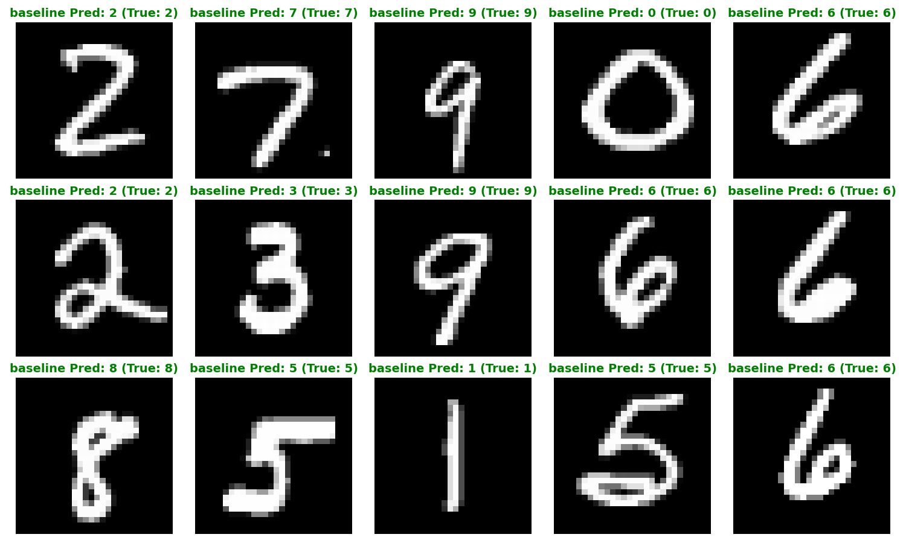
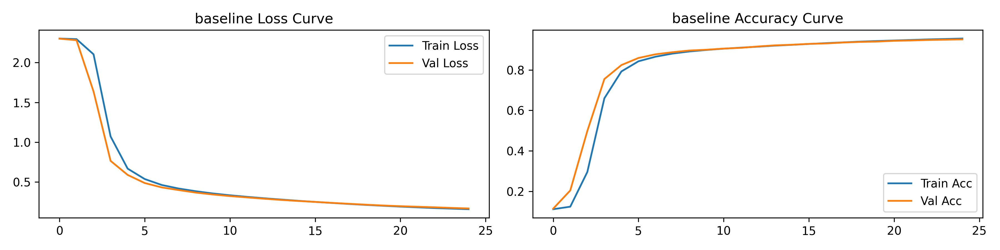
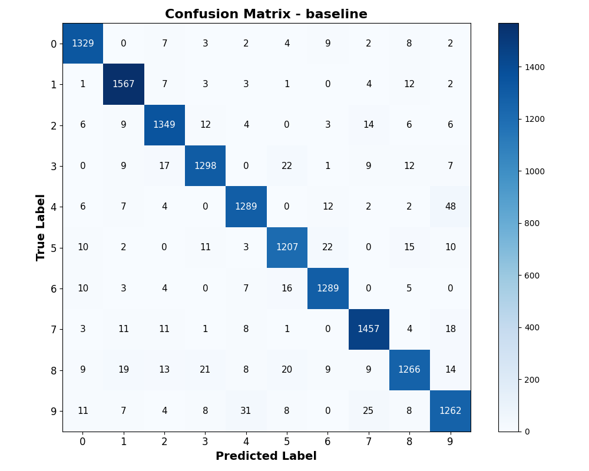
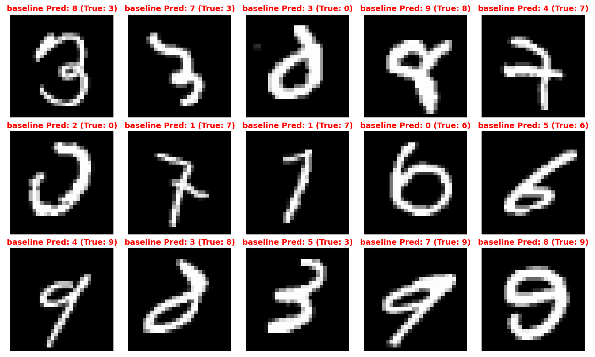
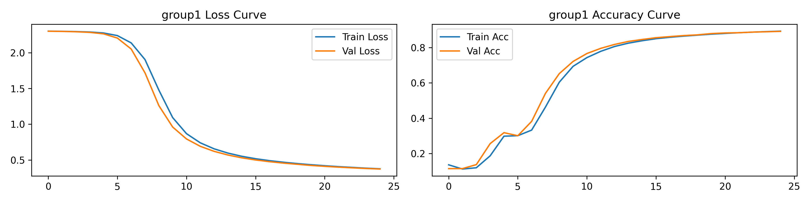
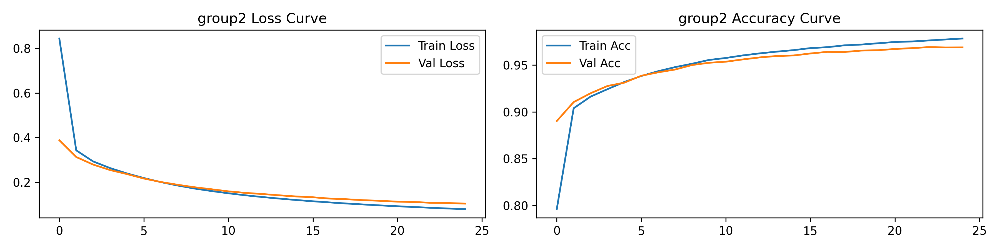

# 实验1：多层神经⽹络的numpy实现

**日期：2026年3月14日**

## 小组信息

|  姓名   |      学号      |     班级     |
|:-----:|:------------:|:----------:|
|  罗畅   |  M202573189  |  电信硕2508班  |
|  赵甫霖  |  M202573190  |  电信硕2508班  |
|  汤雅琴  |  M202573115  |  电信硕2505班  |
|  严子涵  |  D202581370  |  电信博2501班  |

## 实验环境

|     软件/硬件      |            参数/型号             |
|:--------------:|:----------------------------:|
|     操作系统环境     |      macOS tahoe 26.3.1      |
|       芯片       |         Apple M1 Pro         |
|      RAM       |             16GB             |
| Python Version |            3.11.4            |
| numpy Version  |            2.4.3             |
|  Nvidia CUDA   | <font color="red">不支持</font> |

---

## 1. 实验目的

1. 掌握全连接神经⽹络的前向传播与反向传播原理
2. 理解激活函数、损失函数、正则化⽅法的作⽤
3. 通过⼿动实现神经⽹络，深⼊理解深度学习框架底层机制
4. 探索超参数对模型性能的影响规律

## 2. 实验要求

1. 网络架构示意：
   - 输入层：MNIST图像展平为784维向量
   - 隐藏层：⾄少包含2个全连接层（FC），激活函数需⽀持`ReLU/Sigmoid/Tanh`
   - 输出层：10维Softmax输出对应0-9分类概率

```plantuml
// Baseline的网络结构
Input(784) → FC(256) → ReLU → FC(128) → ReLU → Output(10) → Softmax
```

2. 核心实验要求
   - 仅使⽤`numpy`库，禁⽌调⽤`PyTorch/TensorFlow/Keras`等框架
   - 需⼿动实现以下组件： 
     - 全连接层（前向/反向传播） 
     - 激活函数（`ReLU/Sigmoid`及其导数） 
     - 交叉熵损失函数 
     - L2正则化项 
     - Mini-batch梯度下降优化器
3. 性能要求
   - 测试集准确率需要达到$95\%$以上
   - 需对⽐分析不同超参数组合的性能差异

---

## 3. 实验步骤

### 3.1 数据预处理
本实验采用MNIST数据集，处理步骤如下：

- 加载MNIST数据集（建议使⽤`sklearn.datasets.fetch_openml`)
- 像素值归⼀化⾄$[0,1]$，对标签进⾏`One-hot`编码
- 按$8:2$划分训练集/验证集

### 3.2 组件实现
本实验使用`numpy`实现各项底层算子，包括：

- 全连接层
- `ReLU/LeakyReLU/Sigmoid/Tanh`等激活函数
- `Softmax`层和交叉熵损失函数等组件
- 对于进阶优化需求，在全连接层增加可选`Xavier/He`参数初始化

#### 3.2.1 全连接层的初始化、前向传播与反向传播

全连接层（Fully Connected Layer）是多层感知机的核心算子，负责对输入特征进行线性仿射变换。
为了保证深层网络的数值稳定性，本部分在实现基础前反向传播的同时，深度融合了L2正则化项与自适应初始化策略。

为满足进阶优化需求，本实验通过init_method参数引入了**三种初始化方法**：

1. Normal 初始化：$W \sim \mathcal{N}(0, 0.01^2)$，仅作为Baseline对照组。
2. `Xavier(Glorot)`初始化：旨在使输入与输出的方差保持一致，适用于`Tanh`和`Sigmoid`等关于原点对称的饱和型激活函数。其权重从零均值的高斯分布中采样，方差缩放为：

$$
\text{Var}(W) = \frac{2}{n_{in} + n_{out}}
$$

3. `He(Kaiming)`初始化：由于`ReLU`激活函数会将负半轴信号强制截断为0，导致方差减半。`He`初始化强行将权重的方差放大两倍以补偿信号损失，是深层`ReLU`网络的标配。方差缩放公式为：

$$
\text{Var}(W) = \frac{2}{n_{in}}
$$

偏置项$b$在所有策略下均统一初始化为零向量。

**前向传播**在`Mini-batch`模式下，设批次样本数为$m$，输入矩阵为$X \in \mathbb{R}^{m \times n_{in}}$，权重矩阵为$W \in \mathbb{R}^{n_{in} \times n_{out}}$，偏置为$b \in \mathbb{R}^{1 \times n_{out}}$。前向传播进行标准矩阵乘法与偏置广播：

$$
Z = XW + b
$$

其中输出矩阵$Z \in \mathbb{R}^{m \times n_{out}}$将作为下游激活函数的输入。

**反向传播**的核心在于利用链式法则计算误差梯度，并严格遵循矩阵维度的对齐规则 。设上一层回传的误差梯度矩阵为$dZ \in \mathbb{R}^{m \times n_{out}}$，L2 正则化系数为 $\lambda$。

- 权重梯度$dW$计算目标是求得与 $W$ 维度完全一致的 $\frac{\partial L}{\partial W}$。通过输入矩阵的转置与误差矩阵相乘，并叠加L2正则化惩罚项的导数 $\lambda W$：

$$
dW = \frac{1}{m} X^T \cdot dZ + \frac{\lambda}{m} W
$$

- 偏置梯度$db$计算：偏置在前向传播时被广播到了每一个样本上，因此反向传播时需沿Batch维度（axis=0）进行梯度累加求均值：

$$
db = \frac{1}{m} \sum_{i=1}^m dZ^{(i)}
$$

- 向后传递的误差梯度$dX$：为继续向浅层网络传递梯度，需计算对输入$X$的导数，此时转置落在权重矩阵$W$上：

$$
dX = dZ \cdot W^T
$$

该矩阵$dX \in \mathbb{R}^{m \times n_{in}}$将作为上一层（如有）的$dZ$继续参与链式求导。

```python
class FullyConnectedLayer:
    def __init__(self, input_dim, output_dim, init_method, l2_reg=0.0):
        # 根据传入参数选择初始化策略
        if init_method == 'normal':
            # 原始基础方案
            self.W = np.random.randn(input_dim, output_dim) * 0.01
        elif init_method == 'xavier':
            # Xavier (Glorot) 初始化：方差缩放为 2 / (fan_in + fan_out)
            self.W = np.random.randn(input_dim, output_dim) * np.sqrt(2.0 / (input_dim + output_dim))
        elif init_method == 'he':
            # He (Kaiming) 初始化：方差缩放为 2 / fan_in
            self.W = np.random.randn(input_dim, output_dim) * np.sqrt(2.0 / input_dim)
        else:
            raise ValueError(f"[Error] 不支持的初始化方法: {init_method}。请使用 'normal', 'xavier' 或 'he'。")
        self.b = np.zeros((1, output_dim))
        self.l2_reg = l2_reg
        self.X = None
        self.dW = None
        self.db = None

    def forward(self, X):
        self.X = X
        # Z=XW+b
        return np.dot(X, self.W) + self.b

    def backward(self, dZ):
        m = self.X.shape[0]
        # 核心矩阵求导，加入L2正则化梯度项
        # 权重W求导 dW=(1/m)*X^T*dZ+(lambda/m)*W
        self.dW = np.dot(self.X.T, dZ) / m + (self.l2_reg / m) * self.W
        # 偏置b求导，db=(1/m)*sum(dZ,axis=0)，使用keepdims=True保证形状，而不是退化为一维向量
        self.db = np.sum(dZ, axis=0, keepdims=True) / m
        # 反向传播
        # 对输出X求导，dX=dZ*W^T
        dX = np.dot(dZ, self.W.T)
        return dX
```

#### 3.2.2 激活函数与梯度求导

要求实现`ReLU/LeakyReLU/Sigmoid/Tanh`等激活函数并实现其导数。在底层的`numpy`向量化实现中，反向传播的核心在于利用前向计算的缓存矩阵，从而避免冗余计算。

- `ReLU`与`LeakyReLU`的分段截断

`ReLU`的非线性截断是抵抗深层网络梯度消失的核心。其逐元素导数分段函数为：

$$
f'(z) = \begin{cases} 1 & z > 0 \\ 0 & z \le 0 \end{cases}
$$

为克服负半轴梯度截断导致的“死神经元”现象，引入`LeakyReLU`，设置泄露系数$\alpha=0.01$：

$$
f'(z) = \begin{cases} 1 & z > 0 \\ \alpha & z \le 0 \end{cases}
$$

实现层面，借助`numpy`的布尔索引和掩码机制，以极低的内存开销完成梯度放缩：

```python
class ReLU:
    # __init__函数和forward函数省略
    def backward(self, dA):
        # ReLU 导数：Z > 0 时为 1，否则为 0
        dZ = dA.copy()
        dZ[self.Z <= 0] = 0
        return dZ

class LeakyReLU:
    # __init__函数和forward函数省略
    def backward(self, dA):
        dZ = dA.copy()
        # Z<=0的位置，梯度乘alpha；Z>0的位置，梯度保持1
        dZ[self.Z <= 0] *= self.alpha
        return dZ
```

- 饱和型激活函数（Sigmoid / Tanh）的复用求导

对于饱和型非线性映射，其导数可优雅地通过前向输出矩阵 $A$ 表达 。为防止前向传播时 $e^{-z}$ 在 float64 精度下溢出（Overflow），需对输入实施严格的数值截断。
推导后的矩阵形式极简梯度为：
- Sigmoid: $\frac{\partial L}{\partial Z} = dA \odot A \odot (1 - A)$
- Tanh: $\frac{\partial L}{\partial Z} = dA \odot (1 - A^2)$

```python
class Sigmoid:
    # __init__函数和forward函数省略
    def backward(self, dA):
        # Sigmoid 导数的极简矩阵形态：A * (1 - A)
        return dA * self.A * (1.0 - self.A)

class Tanh:
    # __init__函数和forward函数省略
    def backward(self, dA):
        # Tanh 导数：1 - A^2
        return dA * (1 - self.A ** 2)
```

#### 3.2.3 `Softmax`与交叉熵的雅可比化简

实验要求实现独立输出与交叉熵损失，若在反向传播中将`Softmax`与`CrossEntropy`割裂计算，需分别对`Softmax`求解高阶的雅可比矩阵（Jacobian Matrix），不仅数学推导繁琐，且在`Mini-batch`模式下面临内存与计算的断崖式暴跌。

本工程采用联合求导策略。设本批次样本数为$m$，全连接层输出`Logits`矩阵为$Z$，真实标签`One-hot`矩阵为 $Y$，经过`Softmax`激活后的预测概率矩阵为$P$。
带有平滑项（防止对数下溢）的交叉熵损失函数定义为：

$$
L = -\frac{1}{m} \sum_{i=1}^m \sum_{k=1}^K Y_{i,k} \log(P_{i,k} + \epsilon)
$$

根据矩阵微积分的链式法则，损失函数对输入$Z$的梯度在经历了雅可比矩阵的内部抵消后，最终化简为极其优美的残差矩阵形式：

$$
\frac{\partial L}{\partial Z} = P - Y
$$

该化简将复杂的张量运算降维为一次简单的矩阵减法，极大地提升了反向传播的吞吐量：

```python
class SoftmaxCrossEntropy:
    """
    将 Softmax 与 交叉熵 合并，避免 Jacobian 矩阵计算导致的性能断崖与数值溢出
    """
    # __init__函数和forward函数省略
    def backward(self):
        # 梯度简化为预测概率 P - 真实标签 Y
        return self.Y_pred - self.Y_true
```

### 3.3 模型组装

使用3.2中定义的底层算子组件，组装为一个完整的全连接层网络，需要满足：

- 根据不同参数初始化不同的模型网络
- 前向传播、后向传播、参数更新

```python
import numpy as np
from components import FullyConnectedLayer, ReLU, Tanh, Sigmoid, SoftmaxCrossEntropy, LeakyReLU

class Model:
    def __init__(self, layer_dims, init_method, activation='relu', l2_reg=0.0):
        self.layers = []
        self.l2_reg = l2_reg

        # 按照 input -> FC -> Act -> FC -> Act -> output 串联
        for i in range(len(layer_dims) - 1):
            self.layers.append(FullyConnectedLayer(layer_dims[i], layer_dims[i + 1], init_method, l2_reg))
            # 最后一层全连接后不加常规激活函数
            if i < len(layer_dims) - 2:
                if activation == 'relu':
                    self.layers.append(ReLU())
                elif activation == 'leaky_relu':
                    self.layers.append(LeakyReLU())
                elif activation == 'tanh':
                    self.layers.append(Tanh())
                elif activation == 'sigmoid':
                    self.layers.append(Sigmoid())

        self.loss_fn = SoftmaxCrossEntropy()

    def forward(self, X, Y):
        out = X
        for layer in self.layers:
            out = layer.forward(out)

        # 计算基础交叉熵损失
        data_loss = self.loss_fn.forward(out, Y)

        # 加入 L2 正则化惩罚项
        l2_loss = 0.0
        if self.l2_reg > 0:
            for layer in self.layers:
                if isinstance(layer, FullyConnectedLayer):
                    l2_loss += 0.5 * self.l2_reg * np.sum(layer.W ** 2)

        m = X.shape[0]
        total_loss = data_loss + (l2_loss / m)
        return total_loss, self.loss_fn.Y_pred

    def backward(self):
        # 从损失函数开始，逆序传播梯度
        dout = self.loss_fn.backward()
        for layer in reversed(self.layers):
            dout = layer.backward(dout)

    def update_params(self, lr):
        # Mini-batch 梯度下降参数更新
        for layer in self.layers:
            if isinstance(layer, FullyConnectedLayer):
                layer.W -= lr * layer.dW
                layer.b -= lr * layer.db
```

### 3.4 模型训练

根据不同超参设置，分别运行Baseline和两组对照实验，超参设置如下：

|   实验组    |   隐藏层结构   |    激活函数     |  学习率  | Batch Size | L2系数 |
|:--------:|:---------:|:-----------:|:-----:|:----------:|:----:|
| Baseline | [256,128] |   `ReLU`    | 0.01  |     64     | 1e-4 |
|    组1    | [512,256] | `LeakyReLU` | 0.005 |    128     | 1e-3 |
|    组2    |   [128]   |   `Tanh`    | 0.02  |     32     |  0   |

除上述超参外，统一设置训练轮数`epochs`默认为25轮。

#### 3.5 实验运行

编写`main.py`接收参数设置，启动模型训练与评估；为运行对照实验，编写`run_exp.sh`脚本，批量执行并得到实验结果。

为满足实验报告可视化要求，在`utils.py`中，增加如下函数：

- `plot_curve`：用于绘制训练/验证损失曲线图；
- `visualize_predictions`：用于可视化随机的15个分类案例；
- `visualize_errors`：用于可视化随机的15个分类错误案例；
- `plot_confusion_matrix`：用于绘制混淆矩阵。

## 4. 结果分析

经过25轮训练，baseline与组2达到$95\%+$的准确率，而组1仅达到$89.17\%$的准确率。

使用可视化工具，在baseline组中，随机选取15个样本可视化结果如下：



### 4.1 训练/验证损失曲线

Baseline组的Loss和Accuracy曲线图如下所示：



可以看到，Baseline组模型的`Train Loss`和`Val Loss`在20个`Epoch`内紧密咬合，未出现经典的“U型”反弹，证明模型未陷入“死记硬背”的过拟合情况。

而且，在前几个`Epoch`中，`Val Loss`略低于`Train Loss`，证明这是加入L2正则化惩罚项的居然数学结果，体现出L2正则化的过拟合控制能力。

### 4.2 混淆矩阵与分类错误案例可视化

Baseline组的混淆矩阵和随机的15个分类错误案例如下图所示：

<div align="center">
    
    
</div>

从混淆矩阵中可以看出，对角线颜色最深，说明baseline性能尚可达标，非对角线上仍有不为0的数据，颜色越深说明误判越严重（例如将4预测为9，将3预测为5）,说明这些数字之间存在一定的相似性，模型未能彻底掌握其区分方法。

### 4.3 超参敏感性分析

Baseline组、组1和组2的Loss/Accuracy曲线图如下所示：
<div align="center">
    
    
    
</div>

通过对比三组实验的收敛轨迹，可以清晰观察到超参对神经网络优化的影响：

观察组1的loss曲线，模型在最初的0-4个`Epoch`内几乎处于停滞状态（`Train Loss`维持在2.3左右，`Accuracy`徘徊在$10\%$的随机盲猜水平）。

其底层原因是：

> 在Mini-batch梯度下降中，Batch Size越大，梯度的方差越小，方向越准确。根据深度学习的线性缩放法则，当Batch Size从64翻倍到128时，学习率理应同比例放大以加速收敛。然而组1却将学习率砍半至0.005，导致每次参数更新的步长极度微小。
> 
> 更致命的是，组1**配置了高达1e-3的L2正则化系数**。在微弱的学习率下，真实数据带来的误差梯度完全被巨大的权重衰减惩罚项所掩盖，导致模型在初期陷入了严重的**欠拟合**状态，直到5个Epoch后才勉强寻找到下降梯度。

观察组2的loss曲线，其优化表征与组1呈现出两个极端。Loss在第一个`Epoch`就出现了断崖式下跌，但在训练后期（`Epoch` 15-25），`Train Loss`仍在持续下降，而`Val Loss`已经彻底彻底平缓，两者之间裂开了一道明显的“过拟合缝隙”。同理，其`Train Acc`逼近$0.98$，但`Val Acc`停滞在$0.96$左右。

其底层原因是：

> 组2将L2系数设为 0，彻底去除了对网络权重的结构性约束。配合极小的Batch Size(32)和激进的学习率(0.02)，模型在参数空间中进行了剧烈且无约束的跳跃。
> 
> 虽然`Tanh`激活函数和激进的更新步长让其在训练集上迅速拟合了数据（甚至拟合了噪声），但由于缺乏正则化保护，模型丧失了部分泛化能力，展现出明显的**过拟合**趋势。

对比之下，Baseline组展现了完美的健康收敛态势。$0.01$的学习率与$64$的Batch Size提供了充足的梯度信噪比，而$1e-4$的L2正则化精准地压制了过拟合，使得`Train Loss`与`Val Loss`在25个`Epoch`内几乎重合，达成了偏差与方差的最佳平衡。

## 5. 讨论

本实验通过对照组的设置，深入探讨了影响全连接神经网络底层优化的一些核心要素。

### 5.1 不同激活函数对梯度消失的影响

在深度神经网络的反向传播中，根据链式法则，误差梯度需要经过每一层激活函数导数的连乘才能传达至浅层网络。不同激活函数的导数极值直接决定了网络的生死：
- `Sigmoid`的导数公式为$f'(z) = f(z)(1-f(z))$。其导数的最大值仅在$z=0$时取得，且最大值仅为0.25。如果网络有$n$个隐藏层，梯度传回输入层时将至少被乘以$0.25^n$。这种指数级衰减导致浅层网络的权重完全无法更新（即梯度消失），模型退化为浅层线性模型。
- `Tanh`的导数为$1 - f(z)^2$ 。其最大值为1，且输出零中心化，缓解了`Sigmoid`带来的锯齿状更新轨迹。但当输入$|z|$较大时，导数依然迅速饱和至0，无法根除梯度消失问题。
- Baseline组采用的`ReLU`激活函数  在正半轴导数恒为1，完美斩断了链式法则中的梯度衰减，使得百层以上的深层网络训练成为可能。而针对组1采用的`LeakyReLU`，其物理直觉在于：当神经元因学习率过大或异常初始化落入负区（$z \le 0$）时，标准`ReLU`的零梯度会导致“死神经元”现象；`LeakyReLU`通过保留极小的负半轴斜率（如 $\alpha=0.01$），为陷入负区的神经元提供了一丝微弱的梯度回流，极大地提升了模型在应对极端超参数时的鲁棒性。

### 5.2 正则化方法如何平衡偏差-⽅差

机器学习的核心优化目标是在偏差（Bias，欠拟合）和方差（Variance，过拟合）之间寻找帕累托最优，而L2正则化是实现该平衡最直接的代数杠杆。

- 如组2所示，当L2系数为0时，网络在巨大的参数空间中没有任何约束。模型为了贪婪地降低训练误差，会利用极其复杂的扭曲超平面去拟合训练集中的随机噪声。这导致其在训练集上表现极佳，但在验证集上泛化能力断崖式下跌，陷入**过拟合**困境。
- 如组1所示，尽管其网络极宽（[512, 256]），但配置了全场最高的1e-3的L2惩罚系数。过重的权重惩罚使得目标函数 $L = L_{data} + \frac{\lambda}{2m}\|W\|^2$ 中的正则化项反客为主，强行将所有权重拉拽向0。网络被迫切断大量特征连接，丧失了拟合复杂数据的能力，陷入**欠拟合**的停滞状态。
- Baseline组的1e-4正则化系数提供了完美的制衡。L2正则化在几何上等价于限制了权重向量的L2球体半径。它强迫网络在同等训练误差下，优先选择权重分布更均匀、数值更小的平滑解。其牺牲了微小的训练集拟合精度，换取了对未知数据极强的泛化鲁棒性。

### 5.3 网络深度与模型性能的关系

业界常有“越深越好”的迷思，但本实验表明，在多层感知机（MLP）架构下，盲目增加网络深度不仅无法提升性能，反而会带来灾难性的优化阻力。

通用近似定理证明，只要拥有足够宽的单隐藏层网络，理论上可拟合任意连续函数。将网络从2层加深至4层，其核心优势在于能以指数级减少所需神经元数量，折叠出更高级的语义特征。但对于MNIST这种简单的784维手写数字映射，浅层网络（如组2的[128]或Baseline的[256, 128]）的容量已然触碰到了数据集的特征天花板。

随着深度增加，参数量剧增。如果像组1那样强行将结构拓宽拓深至[512, 256]，多重矩阵相乘会让条件数恶化。此时若无残差连接或Batch Normalization的加持，极易发生梯度弥散或梯度爆炸。

  结论：**在基础全连接网络中，网络深度的增加与模型性能并非简单的线性正相关。** 必须配合严格的参数初始化、合理的正则化力度以及动态缩放的学习率，才能让深层网络的表征红利转化为真实的测试集收益。

## 附录
本实验源代码与实验结果开源于Github：[numpy_nn_lab](https://github.com/HUSTerCH/numpy_nn_lab)

<font color="#476582"><i>本实验使用组内成员[罗畅](https://github.com/HUSTerCH?tab=repositories)和[赵甫霖](https://github.com/Holidayrabbit)独立开发的Markdown转PDF开源工具[MakePress](https://github.com/HUSTerCH/markpress)完成报告撰写，欢迎体验！</i></font>